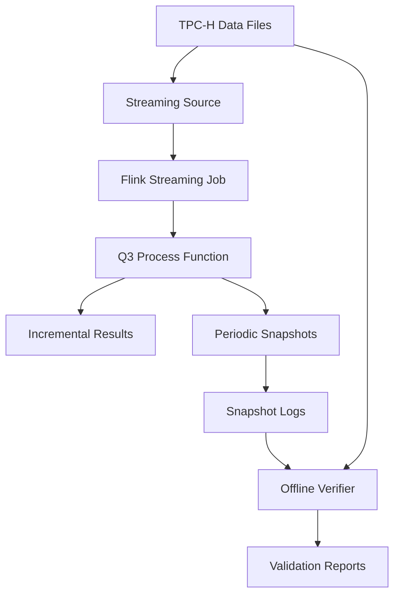

# Independent-Project
Incremental Evaluation of TPC-H Query 3 over Streaming Data Using Flink
# Incremental Evaluation of TPC-H Query 3 over Streaming Data Using Flink

## 📋 Project Overview

This project implements an **incremental streaming computation** of TPC-H Query 3 using Apache Flink. It demonstrates how complex analytical queries can be evaluated efficiently over streaming data with **real-time updates**, **FIFO windowing**, and **periodic correctness verification**.

**Key Features:**
- ✅ **Incremental Computation**: Real-time processing of customer, order, and lineitem updates
- ✅ **FIFO Streaming**: Simulates realistic streaming scenarios with sliding windows
- ✅ **State Consistency Verification**: Offline verifier ensures computational correctness
- ✅ **Performance Monitoring**: Tracks event counts and computational errors
- ✅ **Fault Tolerance**: Periodic snapshots for state recovery

## 🏗️ Architecture



## 📁 Project Structure

```
tpch-q3-flink/
├── src/main/java/tpch/
│   ├── model/              # Data Models
│   │   ├── Customer.java   # Customer entity
│   │   ├── GroupKey.java   # Aggregation key
│   │   ├── Lineitem.java   # Line item entity
│   │   ├── Orders.java     # Order entity
│   │   └── UpdateEvent.java # Update operation wrapper
│   ├── parser/             # Data Parsers
│   │   ├── CustomerParser.java
│   │   ├── LineitemParser.java
│   │   └── OrdersParser.java
│   ├── process/           # Streaming Processing Logic
│   │   └── Q3ProcessFunction.java # Core processing logic
│   ├── source/            # Data Sources
│   │   └── TPCHFIFOStreamingSource.java # FIFO streaming simulator
│   └── verifier/          # Offline Verification
│       ├── Q3IntervalVerifier.java   # State consistency checker
│       └── Q3StreamingJob.java       # Main entry point
├── resources/
│   ├── customer.tbl       # TPC-H test data
│   ├── orders.tbl         # TPC-H test data
│   └── lineitem.tbl       # TPC-H test data
├── logs/                  # Runtime logs
│   └── flink_snapshot.log # Flink state snapshots
├── pom.xml               # Maven configuration
└── README.md             # This file
```

## 🔧 Core Components

### 1. **Q3StreamingJob** (`Q3StreamingJob.java`)
- Main application entry point
- Configures Flink execution environment
- Sets parallelism to 2
- Connects data source to processing function

### 2. **Q3ProcessFunction** (`Q3ProcessFunction.java`)
- **Core streaming processing logic**
- Maintains four state types:
  - `customers`: Filtered customer records
  - `orders`: Filtered order records  
  - `lineitems`: Line item collections per order
  - `revenue`: Aggregated revenue per grouping key
- Supports periodic snapshots (every 10,000 events)
- Handles INSERT/DELETE operations incrementally

### 3. **TPCHFIFOStreamingSource** (`TPCHFIFOStreamingSource.java`)
- **Simulates streaming data source**
- Customers and orders: one-time insertion
- Line items: FIFO window processing (size: 1,000)
- Emits `UpdateEvent` objects with operation types

### 4. **Q3IntervalVerifier** (`Q3IntervalVerifier.java`)
- **Offline state consistency verifier**
- Replays complete data stream
- Compares against Flink snapshots every 50,000 events
- Calculates average and maximum error statistics

## 📊 TPC-H Query 3 Business Logic

**Query Definition:**
```sql
SELECT
    l_orderkey,
    o_orderdate,
    o_shippriority,
    SUM(l_extendedprice * (1 - l_discount)) AS revenue
FROM
    customer,
    orders,
    lineitem
WHERE
    c_mktsegment = 'BUILDING'
    AND c_custkey = o_custkey
    AND l_orderkey = o_orderkey
    AND o_orderdate < DATE '1995-03-15'
    AND l_shipdate > DATE '1995-03-15'
GROUP BY
    l_orderkey,
    o_orderdate,
    o_shippriority
ORDER BY
    revenue DESC,
    o_orderdate
LIMIT 10;
```

**Implementation Parameters:**
- Market segment: `'BUILDING'`
- Date threshold: `1995-03-15`
- Output: Revenue changes grouped by `(orderkey, orderdate, shippriority)`

## 🚀 Getting Started

### Prerequisites
- Java 11 or higher
- Apache Maven 3.6+
- Apache Flink 1.17.2 (included via Maven)

### Build the Project
```bash
mvn clean package
```

### Run the Streaming Job
```bash
mvn exec:java -Dexec.mainClass="tpch.Q3StreamingJob"
```

### Run the Offline Verifier
```bash
mvn exec:java -Dexec.mainClass="tpch.verifier.Q3IntervalVerifier"
```

## ⚙️ Configuration Parameters

### Streaming Processing (`Q3ProcessFunction.java`)
```java
private static final String SEGMENT = "BUILDING";
private static final LocalDate DATE = LocalDate.of(1995, 3, 15);
private static final long VERIFY_INTERVAL = 10_000;  // Snapshot interval
private static final double EPS = 1e-9;              // Floating-point tolerance
```

### Verifier (`Q3IntervalVerifier.java`)
```java
private static final long VERIFY_INTERVAL = 50_000;  // Verification interval
```

### Data Source (`TPCHFIFOStreamingSource.java`)
```java
private static final int WINDOW_SIZE = 1000;  // FIFO window size
```

## 📈 Monitoring & Verification

### Real-time Output
Streaming job emits incremental updates:
```
[Q3 UPDATE] orderKey=123, date=1995-01-01, priority=0, oldRevenue=100.00, newRevenue=150.00
```

### State Snapshots
Periodically saved to `logs/flink_snapshot.log`:
```
SNAPSHOT,event=10000,orderKey=123,date=1995-01-01,priority=0,revenue=150.000000
```

### Verification Results
Verifier outputs statistical information:
```
[VERIFY] event=50000 compared=120 avgError=1.23e-06 maxError=5.67e-05
[FINAL VERIFY] totalCompared=60000 avgError=2.34e-06 maxError=7.89e-05
```

## 🔍 Key Technical Features

### 1. **Incremental Computation**
- Processes only data changes, not full recomputation
- Handles both INSERT and DELETE operations
- Maintains intermediate aggregation states

### 2. **FIFO Windowing**
- Simulates realistic streaming workloads
- Maintains fixed-size window for line items
- Ensures bounded memory usage

### 3. **State Management**
- Uses Flink's `MapState` for efficient state storage
- Periodic snapshots for fault tolerance
- Clean state removal for zero-value aggregations

### 4. **Correctness Guarantees**
- Exact floating-point handling (eliminates negative zero)
- Offline verification ensures computational correctness
- Error statistics monitor precision loss

### 5. **Performance Optimizations**
- Key-based partitioning
- Early filtering reduces state size
- Batched snapshot writing

## 📊 Performance Metrics

The system tracks:
- **Event Processing Rate**: Events per second
- **State Size**: Number of entries in each state
- **Computational Error**: Difference between incremental and batch results
- **Snapshot Frequency**: Time between state checkpoints

## 🧪 Testing Methodology

### 1. **Functional Testing**
- Small dataset verification
- Edge case handling (empty results, zero values)
- Operation type testing (INSERT/DELETE)

### 2. **Correctness Testing**
- Offline verifier comparison
- Error threshold validation (< 1e-6)
- State consistency checks

### 3. **Performance Testing**
- Varying window sizes (500, 1000, 2000)
- Different snapshot intervals
- Parallelism tuning (1, 2, 4)

### 4. **Recovery Testing**
- Simulated failures
- State restoration from snapshots
- Processing continuity verification

## 📝 Usage Notes

1. **Data Preparation**: Ensure TPC-H test files are in `resources/` directory
2. **Log Directory**: Create `logs/` directory before first run
3. **Memory Configuration**: Adjust JVM parameters based on data size
4. **Floating-Point Precision**: Uses tolerance value for comparisons

## 🚨 Known Limitations

1. **Data Size**: Designed for 1GB datasets; larger datasets may require memory tuning
2. **Window Size**: Fixed FIFO window; adaptive windows not implemented
3. **Parallelism**: Limited to key-based partitioning; custom partitioners not included
4. **Verification**: Offline verifier requires complete data replay

## 🔮 Future Enhancements

1. **Adaptive Windowing**: Dynamic window size based on data characteristics
2. **Distributed Verification**: Online verification without full replay
3. **More TPC-H Queries**: Extend to other TPC-H queries
4. **Benchmark Suite**: Comprehensive performance benchmarking
5. **Visualization Dashboard**: Real-time monitoring dashboard

## 📚 References

- [TPC-H Benchmark Specification](http://www.tpc.org/tpch/)
- [Apache Flink Documentation](https://nightlies.apache.org/flink/flink-docs-release-1.17/)
- [Stream Processing Patterns](https://www.oreilly.com/library/view/stream-processing-with/9781491973855/)
- [Incremental View Maintenance](https://dl.acm.org/doi/10.1145/135226.135232)

## 📄 License

This project is licensed under the Apache License 2.0 - see the LICENSE file for details.

## 🤝 Contributing

Contributions are welcome! Please feel free to submit a Pull Request.

1. Fork the repository
2. Create your feature branch (`git checkout -b feature/amazing-feature`)
3. Commit your changes (`git commit -m 'Add some amazing feature'`)
4. Push to the branch (`git push origin feature/amazing-feature`)
5. Open a Pull Request

## 👥 Authors

- **Project Developer** - [Your Name]
- **Supervisor** - [Supervisor Name]
- **Institution** - [Your University/Organization]

## 🙏 Acknowledgments

- Apache Flink community for the excellent streaming framework
- TPC Council for the TPC-H benchmark specification
- All contributors and testers who helped improve this project

